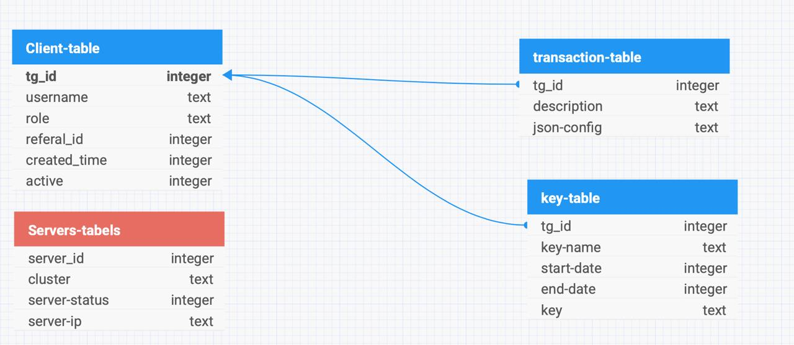

# BGB version 1.1


## Цель данной ветки

Цель данной ветки внести изменения в файл db.py для приведения класса базы данных к лучшему виду


## Введение

Проект был создан для автоматизации управления подписками и подключения к VPN-серверам через протокол **Shadowsocks**, который зарекомендовал себя как надёжная и удобная альтернатива традиционным протоколам.

Основной особенностью данного проекта является поддержка **динамических ключей**, которые позволяют администраторам менять серверные параметры без участия пользователей. Использование динамических ссылок избавляет от необходимости пересылать новые конфигурации при изменении серверов, что особенно важно в условиях ограничений или блокировок.

Проект использует Telegram-бот для взаимодействия с пользователями, что делает управление подписками и подключением простым и удобным. Такой подход позволяет избежать необходимости разработки отдельных приложений, что делает сервис более доступным и удобным в современных условиях.

Этот README поможет вам разобраться в функционале проекта, его технических особенностях и возможностях интеграции, а также предоставит необходимые инструкции для настройки и запуска системы.

## Цели проекта
Проект разрабатывался с целью решить следующие задачи:
1. **Автоматизация управления подписками**: Создание удобного интерфейса для управления подписками на VPN-сервис, упрощение процессов активации, проверки и продления.
2. **Гибкость и надежность подключения**: Реализация динамических ключей, позволяющих администраторам изменять параметры подключения без участия пользователей, что исключает необходимость обновления конфигураций вручную.
3. **Простота взаимодействия**: Использование Telegram-бота для упрощённого взаимодействия с пользователями, чтобы они могли легко получать доступ к услугам и управлять своими подписками.
4. **Интеграция с платёжными системами**: Поддержка автоматической обработки платежей через YooKassa и других систем, обеспечивая удобство и безопасность транзакций.
5. **Оптимизация серверной нагрузки**: Балансировка подключений между серверами для равномерного распределения нагрузки и повышения производительности.
6. **Масштабируемость и безопасность**: Создание архитектуры, которая легко адаптируется к увеличению числа пользователей, обеспечивая при этом высокий уровень защиты данных и анонимности.

## Функциональные возможности
1. **Управление пользователями**:
   - Регистрация и авторизация пользователей через Telegram-бот.
   - Назначение ролей (начальный пользователь, активный пользователь, администратор).
   - Гибкое управление статусами подписок и доступами.

2. **Работа с подписками**:
   - Выбор различных тарифных планов (1 месяц, 3 месяца, 1 год).
   - Автоматическая активация подписки после успешной оплаты.
   - Возможность проверки статуса подписки в любое время.

3. **Динамическое подключение через Shadowsocks**:
   - Генерация динамических ключей, позволяющих изменять параметры подключения без участия пользователей.
   - Формирование ссылок для подключения в формате `ssconf://...`, обеспечивающих удобство использования.

4. **Интеграция с платёжными системами**:
   - Автоматическая обработка платежей через YooKassa.
   - Генерация платёжных ссылок и проверка их статуса.

5. **Управление серверами и балансировка нагрузки**:
   - Мониторинг состояния серверов (активный/неактивный).

6. **API для динамического предоставления конфигураций**:
   - Реализация REST API на базе FastAPI для генерации конфигураций в реальном времени.
   - Возможность интеграции API с внешними сервисами.

7. **Автоматизация и масштабируемость**:
   - Запуск веб-приложения через systemd для упрощения управления процессами.
   - Проксирование запросов через Nginx для повышения безопасности и производительности.

8. **Пользовательский интерфейс**:
   - Интуитивно понятный интерфейс Telegram-бота для удобства пользователей.
   - Поддержка кастомных клавиатур для взаимодействия с функциями бота (покупка подписок, проверка статуса и т.д.).

9. **Высокая доступность и простота настройки**:
   - Минимизация взаимодействия пользователя с техническими деталями.
   - Простота добавления новых функций и масштабирования инфраструктуры.

## Технические детали
### Используемые технологии
- **Язык программирования:** Python 3.8+.
- **Telegram API:** aiogram 3.x — асинхронный фреймворк для создания Telegram-ботов.
- **Веб-фреймворк:** FastAPI — для реализации REST API.
- **Протокол VPN:** Shadowsocks — для безопасного и гибкого подключения.
- **База данных:** SQLite3 - для хранения информации о пользователях, подписках и ключах.
- **Платёжная система:** YooKassa API — для автоматизации обработки платежей.
- **Веб-сервер:** Nginx — для проксирования запросов и балансировки нагрузки.
- **Менеджер процессов:** systemd — для управления запуском и мониторингом сервисов.

### Архитектура системы
1. **Telegram-бот**:
   - Обрабатывает запросы пользователей.
   - Генерирует динамические ключи.
   - Взаимодействует с базой данных и API.

2. **API для управления ключами и серверами**:
   - Реализовано на FastAPI.
   - Предоставляет данные для подключения в реальном времени.
   - Поддерживает генерацию динамических ссылок формата `ssconf://`.

3. **Хранение данных**
- Все данные о пользователях, ключах и серверах хранятся в SQLite. Структура базы данных представлена следующим образом:



#### **Таблицы и их описание**
1. **Client-table**:
   - Хранит информацию о пользователях:
     - `tg_id` (integer): уникальный идентификатор пользователя (Telegram ID).
     - `username` (text): имя пользователя.
     - `role` (tesxt): роль пользователя (например, пользователь, администратор).
     - `referal_id` (integer): ID реферера для отслеживания реферальных связей.
     - `created_time` (integer): дата регистрации.

2. **Transaction-table**:
   - Хранит данные о транзакциях, связанных с пользователями:
     - `tg_id` (integer): идентификатор пользователя, связанный с транзакцией.
     - `description` (text): описание транзакции.
     - `json-config` (text): конфигурация транзакции в формате JSON.

3. **Key-table**:
   - Хранит данные о ключах доступа:
     - `tg_id` (integer): идентификатор пользователя, связанный с ключом.
     - `key-name` (text): название ключа.
     - `start-date` (integer): дата старта действия ключа.
     - `end-date` (integer): дата истечения срока действия ключа.
     - `key` (text): сам ключ доступа.
     - `active` (boolean): флаг активности ключа.

4. **Servers-table**:
   - Хранит информацию о VPN-серверах:
     - `server_id` (integer): уникальный идентификатор сервера.
     - `cluster` (text): кластер, к которому относится сервер.
     - `server-status` (boolean): статус сервера (активен/неактивен).
     - `server-ip` (text): ip адресс сервера

#### **Связи между таблицами**
- **Client-table**:
  - Связана с `Transaction-table` и `Key-table` через поле `tg_id`.
- **Transaction-table**:
  - Отражает связь транзакций с конкретными пользователями.
- **Key-table**:
  - Привязывает ключи доступа к пользователям.
- **Servers-table**:
  - Хранит информацию о серверах, но не имеет прямой связи с пользователями.

Эта структура покрывает основные задачи по управлению пользователями, их транзакциями и ключами, а также состоянием серверов. При необходимости она может быть расширена для добавления новых функций.

4. **Динамическое управление подключением**:
   - Генерация уникальных ссылок для каждого пользователя.
   - Возможность изменения серверных параметров без вмешательства пользователя.

5. **Интеграция с платёжной системой**:
   - Генерация и проверка платёжных ссылок.
   - Поддержка разных тарифных планов.

### Структура проекта
### Основные модули
1. **`main.py`**
   - Точка входа в приложение.
   - Отвечает за инициализацию Telegram-бота и запуск основного цикла обработки запросов.
   - Настраивает интеграцию с обработчиками команд, клавиатурами и базой данных.

2. **`handlers.py`**
   - Содержит обработчики команд Telegram-бота.
   - Обеспечивает логику взаимодействия пользователей с ботом (например, команды `/start`, покупка подписки, проверка статуса).
   - Использует вспомогательные модули для работы с базой данных и API.

3. **`payment.py`**
   - Отвечает за интеграцию с платёжной системой YooKassa.
   - Основные функции:
     - Создание платёжных ссылок.
     - Проверка статуса платежей.
     - Логирование транзакций.

4. **`db.py`**
   - Отвечает за подключение и работу с базой данных `users.db`.
   - Содержит функции для записи и извлечения данных о пользователях, подписках и транзакциях.

5. **`kb.py`**
   - Отвечает за создание пользовательских интерфейсов Telegram-бота.
   - Содержит:
     - Клавиатуру стартового меню.
     - Кнопки для выбора подписок и оплаты.
     - Клавиши возврата и навигации.

6. **`config.py`**
   - Содержит конфигурационные параметры приложения:
     - Telegram Bot API Token.
     - Ключи и параметры для YooKassa.
     - Настройки базы данных.

7. **`requirements.txt`**
    - Список зависимостей, необходимых для работы проекта.    - 
    

### Логика взаимодействия
1. **Telegram-бот**:
   - Инициализируется в `main.py`.
   - Принимает команды и перенаправляет их на обработку в `handlers.py`.
   - Генерация ключей осуществляется через `keygen.py`.

2. **База данных**:
   - Управляется через `db.py`.
   - Сохраняет данные о пользователях, транзакциях и ключах.
   - Файл базы данных: `users.db`.

3. **Платёжная система**:
   - Реализована в модуле `payment.py`.
   - Поддерживает генерацию и проверку платёжных ссылок.

4. **Генерация ключей**:
   - Динамические ключи создаются в `keygen.py`.
   - Хранятся и обновляются в базе данных через `db.py`.

5. **Тестирование**:
   - `test.py` используется для проверки корректной работы всех модулей.
##### Основные компоненты
- **aiogram** - используется для асинхронного взаимодействия с Telegram API.
- **Bot** - класс для работы с ботом.
- **Dispatcher** - диспетчер для управления потоком сообщений.
- **MemoryStorage** - хранилище для состояний сессий пользователей.

##### Импорты
- **asyncio** - библиотека для написания асинхронного кода.
- **logging** - модуль для ведения журнала.
- **Bot, Dispatcher, ParseMode, DefaultBotProperties** - компоненты aiogram для работы с ботом и его сообщениями.
- **router (из handlers.py)** - маршрутизатор с предопределенными обработчиками событий.

##### Функция main()
Эта функция инициализирует и запускает бота.
1) Конфигурирует базовую настройку логирования.
2) Инициализация бота с токеном и настройками парсинга.
3) Инициализация диспетчера с хранилищем в памяти.
4) Включение маршрутизатора из `handlers.py` для обработки команд.
5) Начало асинхронного получения и обработки сообщений.

###### Процесс работы
1. **Удаление вебхука** (если вебхук был установлен ранее, он удаляется для корректного запуска поллинга.)
2. **Запуск поллинга** (бот начинает асинхронное получение и обработку сообщений, опираясь на настройки и обработчики, заданные в диспетчере.)

##### Запуск функции main
###### Код для запуска
```python
if __name__ == "__main__":
    logging.basicConfig(level=logging.INFO)
    asyncio.run(main())
```

##### Взаимодействие между модулями
- **main.py и handlers.py**
  `main.py` использует обработчики из `handlers.py` для реакции на действия пользователей.
- **main.py и config.py**
  Использует конфигурационные данные для инициализации параметров бота.
  
#### `handlers.py`
Содержит обработчики команд, которые реагируют на действия пользователя в чате.
Этот модуль содержит обработчики сообщений и запросов от пользователей Telegram. Основная задача этого модуля - управлять взаимодействием пользователя с ботом, начиная от авторизации до обработки конкретных команд.

##### Импорты
- **aiogram** используется для взаимодействия с Telegram API.
- **types, Router, KeyboardButton, и другие компоненты aiogram** - для работы с сообщениями и клавиатурами.
- **config, kb, utils** - это локальные модули для конфигурации, клавиатур и вспомогательных функций.

##### Функция cmd_start(message: types.Message)
Обработчик команды '/start', которая инициирует сессию пользователя.
  1. Получает статус пользователя с помощью функции `utils.get_user_status()`.
  2. В зависимости от статуса выводит соответствующие сообщения и клавиатуры.
  3. Использует клавиатуру `start_kb` из модуля `kb` для отображения начальных опций.
  
##### Функция buySubscription(message: types.Message)
Позволяет пользователю инициировать процесс покупки подписки.
  1. Показывает пользователю клавиатуру с вариантами подписок для покупки.
  2. Использует InlineKeyboardMarkup для создания кнопок.

##### Обработчики call_buy_one_month_subscription и другие по срокам подписки
Обрабатывает выбор конкретной подписки (1 месяц, 3 месяца, 1 год).
  1. При выборе определенной подписки пользователь видит детальную информацию о стоимости и условиях.
  2. Каждая функция использует соответствующий биллинговый интерфейс из `kb` для отображения информации и кнопок оплаты.
  
##### Вспомогательные функции и логика взаимодействия
В модуле также присутствуют вспомогательные функции, такие как функции управления состоянием сессии, например, отображение основного меню после оплаты или возврата, и логика для возврата в предыдущее меню или начала новой сессии.

#### `payment.py`
Модуль, отвечающий за интеграцию с платежной системой и обработку транзакций.
Модуль отвечает за обработку платежей в Telegram-боте. Он интегрирован с платежной системой YooKassa для обеспечения безопасных и удобных транзакций.

##### Импорты
- **config** для получения настроек аккаунта YooKassa.
- **json, uuid, asyncio** для работы с форматами данных и асинхронным программированием.
- **YooKassa API** - библиотека для интеграции с платежной системой.

##### Основные функции
###### payment(item)
- Создает платеж через API YooKassa.
- Из параметров - **`item`** - словарь с деталями товара или подписки, включая описание, стоимость и налоговый код.
- **Процесс работы:**
  1. Генерация уникального ключа идемпотентности с использованием UUID.
  2. Создание объекта платежа с указанием суммы, метода платежа и URL для перенаправления после оплаты.
  3. Запрос к API YooKassa для регистрации платежа.

###### run_payment(item)
Запускает процесс платежа и обрабатывает возможные исключения.
- **`item`** - словарь с деталями товара.
- **Процесс работы:**
  1. Вызов функции `payment` для создания платежа.
  2. Обработка ответа от YooKassa, включая получение URL для перенаправления пользователя на страницу оплаты.
  3. Логирование ошибок и исключений при их возникновении.

###### check_payment(payment_id)
Проверяет статус платежа по его идентификатору.
- **`payment_id`** - Идентификатор платежа в системе YooKassa.
- **Процесс работы:**
  1. Периодический запрос к API YooKassa для получения текущего статуса платежа.
  2. Обработка изменений статуса, например, подтверждение успешной оплаты или обработка ошибок.

##### Взаимодействие с другими модулями
- **payment.py и config.py**
  Использует данные аккаунта и ключи API, указанные в `config.py`.
- **payment.py и handlers.py**
  Функции из `payment.py` вызываются в обработчиках команд в `handlers.py` для инициации и проверки платежей.

#### `utils.py`
Вспомогательный модуль с функциями для работы с пользователями и управления статусами.
Модуль содержит вспомогательные функции для Telegram-бота, которые используются для управления данными пользователей и обработки ключей доступа.

##### Импорты
- **config** для доступа к глобальным настройкам и конфигурациям.
- **json**  для работы с данными в формате JSON.
- **uuid, asyncio** для генерации уникальных идентификаторов и асинхронной обработки.

##### Основные функции
###### get_user_status(user_id)
Проверяет и возвращает статус пользователя.
- **`user_id`** - идентификатор пользователя.
- **Процесс работы:**
  1. Поиск в базе данных или кеше для получения статуса пользователя.
  2. Возвращает значения 'start', 'user', или 'admin', в зависимости от роли и прав пользователя.

###### add_user(status, username, user_id, end_date, server)
Добавляет нового пользователя или обновляет информацию о существующем.
- **`status`** - новый статус пользователя.
- **`username`** - имя пользователя.
- **`user_id`** - идентификатор пользователя.
- **`end_date`** - дата окончания подписки или доступа.
- **`server`** - информация о сервере, к которому предоставлен доступ.
- **Процесс работы:**
  1. Проверка наличия пользователя в базе данных.
  2. Обновление данных или добавление новой записи с указанными параметрами.

###### get_key(user_name)
Возвращает ключ доступа для пользователя.
- **`user_name`** - имя пользователя, для которого нужно получить ключ.
- **Процесс работы:**
  1. Поиск пользователя в системе управления ключами.
  2. Если подписка активна и ключ существует, возвращает URL доступа к серверу.
  3. Если подписка неактивна, возвращает сообщение об этом.

##### Взаимодействие с другими модулями
- **utils.py и config.py**
  Использование глобальных настроек из `config.py` для доступа к параметрам системы.
- **utils.py и handlers.py**
  Функции из `utils.py` вызываются обработчиками из `handlers.py` для проверки статуса пользователей и управления данными.

#### `kb.py`
Модуль, отвечающий за создание клавиатур бота, используемых для навигации.
В модуле определены различные клавиатуры, которые используются для разных этапов взаимодействия с пользователем. Клавиатуры создаются с помощью классов `KeyboardButton` и `InlineKeyboardButton` из библиотеки aiogram.

### Основные клавиатуры
#### start_kb
Клавиатура, отображаемая при старте взаимодействия с ботом.
- **Кнопки:**
  - 'Купить': Перенаправляет пользователя на выбор типа подписки.

#### buy_kb
Клавиатура для выбора типа подписки.
- **Кнопки**:
  - 'Подписка на 1 месяц': Инициирует процесс покупки месячной подписки.
  - 'Подписка на 3 месяца': Инициирует процесс покупки трехмесячной подписки.
  - 'Подписка на 1 год': Инициирует процесс покупки годовой подписки.

### Клавиатуры для оплаты
#### bill_1m, bill_3m, bill_1y
Клавиатуры, предлагающие оплатить выбранную подписку и возвращаться назад.
- **Процесс работы:**
  1. Пользователю предлагается кнопка 'Оплатить', которая ведет на страницу оплаты.
  2. Кнопка 'Назад' возвращает пользователя к выбору других подписок.

Клавиатуры для оплаты взаимодействуют с `payment.py` для инициации платежей. При нажатии на 'Оплатить' вызывается функция `run_payment`, которая обрабатывает транзакции и возвращает URL для оплаты.

#### `config.py`
Файл конфигурации, содержащий токены и ключи API.

## Настройка и запуск
### Настройка
1. `pip install -r requirements.txt` для установки необходимых библиотек.
2. Настройка токенов и ключей в `config.py` для интеграции с API.

### Запуск
Запуск бота осуществляется командой
```bash
python main.py
```
Это запустит бота и он будет готов к приему сообщений от пользователей.

## Дальнейшие шаги и планы развития
В данный момент мы остановились на проблеме отслеживания статуса платежей. Необходимо доработать этот момент. Также планируются к реализации следующие пункты:

## Безопасность и модель угроз
### Ключевые активы
- Данные пользователей: Telegram ID, подписки, динамические ключи.
- Инфраструктура: серверы Telegram-бота, VPN-сервера, базы данных.
- Сервисы: API для ключей, платёжные системы.
- Доступность: устойчивость к сбоям и блокировкам.

### Потенциальные угрозы
- **Конфиденциальность**: утечка данных, перехват ключей.
- **Доступность**: DDoS-атаки, блокировка DNS/DHT.
- **Целостность**: подмена ключей, модификация базы данных.
- **Анонимность**: раскрытие IP или Telegram-аккаунтов пользователей.

### Потенциальные точки атак для инфраструктуры
#### **1. Сервер Telegram-бота**
- **Атаки**:
  - DDoS-атаки для перегрузки сервера и отказа в обслуживании.
- **Риски**:
  - Невозможность обработки запросов пользователей.

#### **2. API для генерации ключей**
- **Атаки**:
  - Brute-force для подбора ключей API или параметров запросов.
- **Риски**:
  - Компрометация базы данных с ключами и подписками.

#### **3. База данных (SQLite)**
- **Атаки**:
  - Получение несанкционированного доступа к базе данных (через сервер или физический доступ).
  - Уничтожение или подмена данных.
- **Риски**:
  - Утечка данных пользователей и подписок.
  - Невозможность работы сервиса.

#### **4. VPN-сервера**
- **Атаки**:
  - DDoS-атаки для перегрузки VPN-серверов.
  - Сниффинг трафика с VPN-серверов.
- **Риски**:
  - Полная недоступность сервиса для клиентов.
  - Нарушение конфиденциальности пользователей.

#### **5. DNS/DHT инфраструктура**
- **Атаки**:
  - DNS Spoofing — подмена DNS-запросов, чтобы перенаправить пользователей на ложные серверы.
  - Блокировка DNS-запросов провайдерами.
  - Атаки на узлы DHT для подмены маршрутов и данных.
- **Риски**:
  - Прерывание доступа пользователей к VPN-серверам.
  - Направление пользователей на вредоносные ресурсы.

#### **6. Логирование и хранение данных**
- **Атаки**:
  - Доступ к незащищённым логам, содержащим чувствительные данные.
  - Анализ логов для идентификации пользователей.
- **Риски**:
  - Утечка информации о пользователях и их активности.
  - Снижение анонимности системы
  

## TODO

### 1. **Улучшение функционала подписок**
- Добавить возможность **автоматического продления подписок**.
- Реализовать уведомления о скором истечении срока подписки с предложением продления.

### 2. **Расширение методов платежей**
- Интегрировать дополнительные платёжные системы (например, PayPal, Stripe, криптовалюты) для повышения удобства пользователей.
- Настроить обработку нескольких способов оплаты в рамках одной системы.

### 3. **Бесшовное добавление новых серверов**
- Обеспечить автоматическую синхронизацию новых серверов с существующей инфраструктурой без необходимости остановки или перенастройки системы.

### 4. **Балансировка нагрузки**
- Реализовать алгоритм **round-robin** для распределения нагрузки между узлами:
  - Балансировка подключения клиентов между узлами сервера VPN.
  - Балансировка нагрузки между различными VPN-серверами для равномерного распределения трафика.

### 5. **Поддержка резервных серверов**
- Настроить системы автоматического переключения на резервные серверы в случае отказа основных.
- Обеспечить синхронизацию данных между основными и резервными серверами в режиме реального времени.

### 6. **Резервирование и бэкап**
- Добавить поддержку резервных серверов для обеспечения высокой доступности.
- Настроить автоматическое создание резервных копий ключевых данных (базы данных, конфигураций и т.д.).

### 7. **Добавить таблицу логов и детектировать запрещённые действия**
- Хранить историю действий пользователей и системных изменений для аудита, анализа активности и выявления подозрительных действий.
- Логировать и анализировать аномалии, такие как попытки покупки/продажи запрещённых вещей, необычная активность или многократные ошибки авторизации.
- Реализовать автоматическую блокировку подозрительных пользователей и уведомление администрации.

### 8. **Интеграция технологии CI/CD**
- Настроить полноценный процесс CI/CD для автоматического развертывания и тестирования обновлений:
  - Проверка кода на ошибки перед деплоем.
  - Автоматическое развертывание новых версий на серверах.
  - Регулярное тестирование работоспособности системы.

### 9. **Потенциальная замена DNS на DHT**
- Исследовать возможности полной замены DNS на DHT для повышения устойчивости к блокировкам и отказам.

### Полезные ссылки на документацию используемых технологий
- **Python**: [Документация Python](https://docs.python.org/3/)
- **FastAPI**: [Документация FastAPI](https://fastapi.tiangolo.com/)
- **SQLite**: [Документация SQLite](https://www.sqlite.org/docs.html)
- **Telegram Bot API**: [Документация Telegram Bot API](https://core.telegram.org/bots/api)
- **aiogram**: [Документация aiogram](https://docs.aiogram.dev/)
- **YooKassa API**: [Документация YooKassa API](https://yookassa.ru/developers/api)

## Контакты
Для связи и поддержки используйте следующиt контактs в Telegram: @sqrt38, @virtual_vista, @egorbelugin
